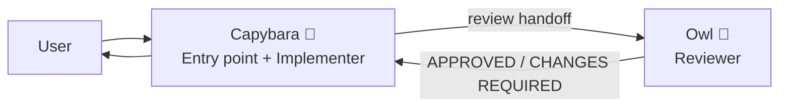
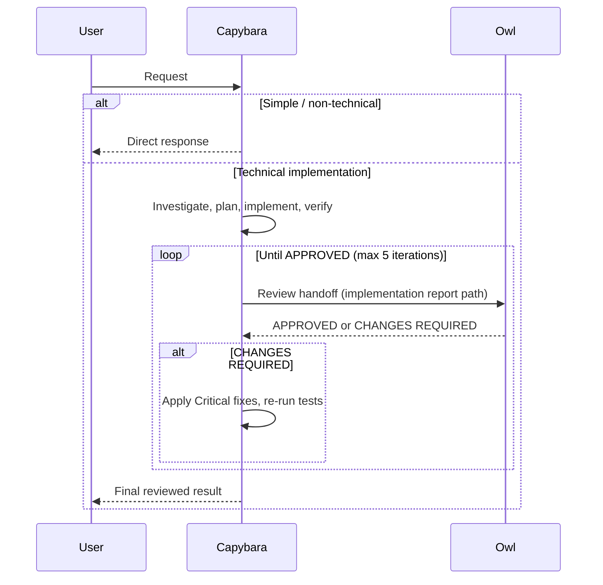

# GitHub Copilot Squad (Simplified)

A simplified, 2-agent orchestration setup for the **GitHub Copilot coding agent**.

This is a leaner variant of [github-copilot-squad](https://github.com/kevinkwee/github-copilot-squad), reduced from a 4-agent team to a focused 2-agent team:

- **Capybara**: entry point **and** implementer that receives the request, does the technical work, then hands off to Owl for review.
- **Owl**: strict independent reviewer / QA gate.

The goal stays the same: keep implementation and review as **separate perspectives**, so technical work goes through a build → review loop before final output. What's removed is the overhead of a separate execution agent and a separate lightweight helper.

## Why this simplified version exists

The original squad offloads implementation to a dedicated builder agent (`Otter`), with `Capybara` acting as a pure router. After using it on real-world tasks, that separation turned out to be **unnecessary** for this setup, for a few reasons:

- **A separate generalist implementer adds little value.** Spinning up a separate agent just to offload execution only pays off when that agent is **specialized**: a frontend specialist, a backend specialist, or a specific-framework specialist that brings domain knowledge the orchestrator lacks. Our implementer (`Otter`) was a **generalist**, just like `Capybara`. Two generalists don't give you more perspective; they give you more handoff overhead.
- **A fresh isolated context per request is expensive.** Because `Otter` is a separate sub-agent, every user request starts in a **fresh, isolated context**. That means more tokens and more time for the agent to re-read the codebase, re-analyze the problem, and rebuild understanding, even for a follow-up that builds directly on what was just done.
- **Merging keeps the working context warm.** When `Capybara` does the implementation itself, it **retains context about what was just built**. A subsequent request doesn't need the agent to reanalyze the same files and decisions over and over; the relevant context is already there.

### The trade-off

Merging the implementer into the entry point is not free:

| Approach | Pro | Con |
| --- | --- | --- |
| **Separate implementer** (`Otter`) | Each request gets a clean, isolated context, so the orchestrator's context window stays small. | Fresh context every time → more tokens and time to re-analyze. Temp reports capture what was done, but not the implementer's chain-of-thought or detailed analysis (what it read and reasoned through), so follow-ups can't reuse that thinking. |
| **Merged into `Capybara`** (this repo) | Full working context (including the chain-of-thought) carries over to follow-ups; no redundant re-analysis; fewer agent handoffs. | The context window grows as the conversation gets longer. |

The original concern with merging was that **the context window would fill up quickly**. In practice (after running it on real, multi-step tasks), that growth turned out to be **slower than expected**, and the benefit of warm, carry-over context outweighed the cost. Hence this simplified version.

> **When to use the original squad instead:** if you start wiring in **specialized** implementers (e.g. a frontend-focused agent that knows a specific UI framework, or a backend agent tuned to a particular stack), the separate-agent model becomes worth it again. This simplified repo assumes a single generalist does the building.

## The 2-agent team

- **Capybara** is the only user-invocable agent. It receives the request, investigates, plans, implements, runs tests, and writes an implementation summary. Then it calls Owl.
- **Owl** is not user-invocable. It reviews Capybara's work independently, classifies findings as Critical or Minor, and returns `APPROVED` or `CHANGES REQUIRED`.
- Capybara applies all of Owl's **Critical** findings, re-reviews if needed, and returns the final result to the user.

## Quick start

### Prerequisites

- GitHub Copilot Chat extension with custom agents support
- VS Code

### Option A: Repo-level agents (recommended)

Store the agent profiles in:

- `.github/agents/*.agent.md`

This makes them available for that repository/workspace.

### Option B: User-level agents

Create/store agent profiles in your user data custom agents location from the **Configure Custom Agents...** button in VS Code.

This makes them available across your workspaces.

### Use it

1. Open Copilot Chat in VS Code.
2. Select `Capybara` from the agents dropdown.
3. Ask your request naturally.
4. For technical requests, `Capybara` implements, then runs an automatic Capybara ↔ Owl review loop.

## How the flow works

### 1) Entry point

`Capybara` receives every request directly. There is no router and no lightweight helper; it handles both technical and simple/non-technical requests itself:

- **Technical request** → investigate, plan, implement, verify, then enter the review loop with Owl.
- **Simple / non-technical request** → answer directly (no Owl review needed).
- **Ambiguous request** → asks a clarification question first.

### 2) Technical review loop (Capybara ↔ Owl)

For technical requests, `Capybara` runs this loop:

1. Create report folder path: `.github/temp_reports/{YYYYMMDD_HHmmss}_{objective}/`
2. Implement the task and write `implementation_1.md` into that folder.
3. Hand off to `Owl` (focused handoff: the implementation report path, not the whole conversation).
4. If `Owl` returns **APPROVED** → return the final result.
5. If `Owl` returns **CHANGES REQUIRED** → apply every Critical fix, re-run tests, increment the iteration, write a fresh `implementation_{iteration}.md`, and call `Owl` again.
6. Repeat until approved, max 5 iterations.

If still not approved after 5 iterations, `Capybara` stops and surfaces the remaining Critical issues for the user to decide.

### Flow diagram

## Agent responsibilities

### Capybara (`Capybara.agent.md`)

- Single entry point: receives requests and acts on them directly.
- Does the technical work: investigate, plan, implement, run tests, lint/format.
- Manages the iterative Capybara ↔ Owl review loop (max 5 iterations).
- Applies **all** of Owl's Critical findings; never skips them by reasoning them away.
- Asks clarifying questions (with freeform input) when the request is ambiguous.
- User-invocable; `disable-model-invocation: true` (so it always runs as the explicit entry point).

### Owl (`Owl.agent.md`)

- Reviews technical output for correctness, completeness, and quality.
- Reads the `implementation_{iteration}.md` summary **and** the actual changed files from disk.
- Runs available tests for touched modules to detect regressions.
- Classifies findings:
  - **Critical** → blocks approval (`CHANGES REQUIRED`)
  - **Minor** → suggestions only
- Writes `review_{iteration}.md` to the report subfolder.
- Not user-invocable; called only by Capybara.

## Project code-writing rules (`AGENTS.md`)

Both `Capybara` and `Owl` treat an attached `AGENTS.md` as the source of truth for the project's stack, idioms, and quality bar (test commands, lint/format, naming, architecture rules). The detailed code-writing rules have been **stripped out** of the agent profiles and moved into a per-project `AGENTS.md` that you provide alongside the agents.

A separate `AGENTS.md` is **easier to update and maintain**, especially when it contains a section that is **managed by the agent itself** (the agent can read and edit `AGENTS.md` in place without you having to edit the bundled agent profile).

> **Coming soon:** No `AGENTS.md` example or template is included in this repo yet. One will be added soon. In the meantime, create your own `AGENTS.md` in your project root describing your stack, test command, linter, and any hard constraints the agents must respect.

## Compared to the original squad

| | Original (`github-copilot-squad`) | Simplified (this repo) |
| --- | --- | --- |
| Agents | 4 (Capybara, Otter, Owl, Squirrel) | 2 (Capybara, Owl) |
| Routing | Capybara is a pure router | No router; Capybara is the entry point |
| Implementation | Offloaded to a separate agent (`Otter`) | Done by Capybara itself |
| Simple / non-technical | Handled by a lightweight helper (`Squirrel`) | Handled by Capybara directly |
| Review | Owl (unchanged) | Owl (unchanged) |
| Context per request | Fresh isolated context for each implementation | Warm, carry-over context between follow-ups |
| Handoffs | More (router → builder → reviewer) | Fewer (builder+orchestrator → reviewer) |
| Best for | Specialized implementers, strict context isolation | Generalist implementer, iterative multi-step work |

## Fun facts 🐣

| Role | Animal | Why it fits |
| --- | --- | --- |
| Entry point + Implementer | Capybara 🦫 | Calm, friendly, and sociable. Comfortable doing the work itself and coordinating the review without the drama. |
| Reviewer | Owl 🦉 | Classic symbol of wisdom and sharp observation. Spots sneaky issues and keeps everything in check. |

> The original squad also had **Otter** 🦦 (the playful, tool-skilled builder) and **Squirrel** 🐿️ (the quick, nimble helper). Both were folded into Capybara here; one generalist builder is enough until you need specialists.

## How to use

- Start chat with `Capybara`.
- Ask naturally:
  - Technical request example: "Add endpoint X with validation and tests."
  - Non-technical request example: "Explain this repository architecture."
- `Capybara` handles it directly, and for technical tasks runs the review loop with `Owl` automatically.
- Reports are generated under `.github/temp_reports/` per iteration.

## Report artifacts

During technical tasks, expect:

- `implementation_{iteration}.md` (from Capybara)
- `review_{iteration}.md` (from Owl)

inside:

- `.github/temp_reports/{timestamp_objective}/`

This creates a lightweight audit trail of what was implemented and what was reviewed.

## Customization

Common tweaks you can make:

- Change models in frontmatter (`model:`)
- Restrict/expand tool access (`tools:`)
- Adjust review strictness in `Owl`
- Change max loop policy in `Capybara` (default: 5 iterations)
- Adapt tone/style prompts

## Official references

- <https://docs.github.com/en/copilot/concepts/agents/coding-agent/about-custom-agents>
- <https://docs.github.com/en/copilot/how-tos/use-copilot-agents/coding-agent/create-custom-agents>
- <https://docs.github.com/en/copilot/reference/custom-agents-configuration>

## License

MIT (see `LICENSE`).
