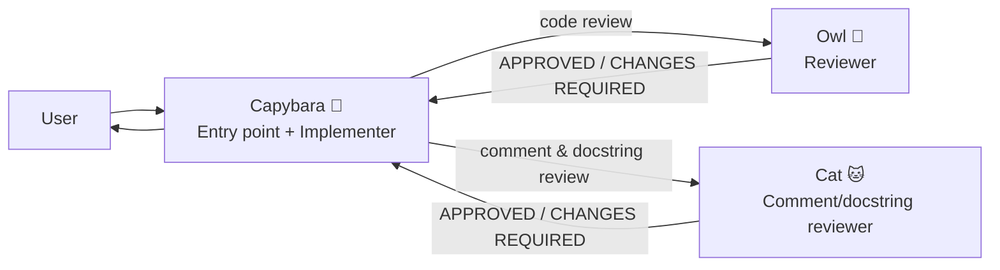
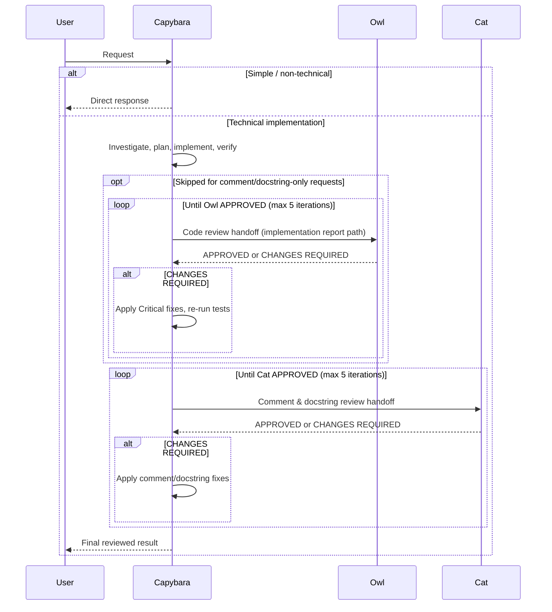

# GitHub Copilot Squad (Simplified)

A simplified orchestration setup for the **GitHub Copilot coding agent**, and a leaner variant of [github-copilot-squad](https://github.com/kevinkwee/github-copilot-squad). It ships in two modes:

- **Trio (default)**: `Capybara` (entry point + implementer) + `Owl` (code reviewer) + `Cat` (comment/docstring reviewer).
- **Duo**: `Capybara` + `Owl` only, with no dedicated comment/docstring pass. The Duo behavior lives in `CapybaraDuo.agent.md`.

In both modes the goal is the same: keep implementation and review as **separate perspectives**, so technical work goes through a build → review loop before final output. What's removed (vs the original 4-agent squad) is the overhead of a separate execution agent and a separate lightweight helper.

## Why this simplified version exists

The original squad offloads implementation to a dedicated builder agent (`Otter`), with `Capybara` acting as a pure router. After using it on real-world tasks, that separation turned out to be **unnecessary** for this setup, for a few reasons:

- **A separate generalist implementer adds little value.** Spinning up a separate agent just to offload execution only pays off when that agent is **specialized**: a frontend specialist, a backend specialist, or a specific-framework specialist that brings domain knowledge the orchestrator lacks. Our implementer (`Otter`) was a **generalist**, just like `Capybara`. Two generalists don't give you more perspective; they give you more handoff overhead.
- **A fresh isolated context per request is expensive.** Because `Otter` is a separate sub-agent, every user request starts in a **fresh, isolated context**. That means more tokens and more time for the agent to re-read the codebase, re-analyze the problem, and rebuild understanding, even for a follow-up that builds directly on what was just done.
- **Merging keeps the working context warm.** When `Capybara` does the implementation itself, it **retains context about what was just built**. A subsequent request doesn't need the agent to reanalyze the same files and decisions over and over; the relevant context is already there.

### The trade-off

Merging the implementer into the entry point is not free:

| Approach | Pro | Con |
| --- | --- | --- |
| **Separate implementer** (`Otter`) | Each request gets a clean, isolated context, so the orchestrator's context window stays small. | Fresh context every time → more tokens and time to re-analyze. Temp reports capture what was done, but not the implementer's chain-of-thought or detailed analysis (what it read and reasoned through), so follow-ups can't reuse that thinking. |
| **Merged into `Capybara`** (this repo) | Full working context (including the chain-of-thought) carries over to follow-ups; no redundant re-analysis; fewer agent handoffs. | The context window grows as the conversation gets longer. |

The original concern with merging was that **the context window would fill up quickly**. In practice (after running it on real, multi-step tasks), that growth turned out to be **slower than expected**, and the benefit of warm, carry-over context outweighed the cost. Hence this simplified version.

> **When to use the original squad instead:** if you start wiring in **specialized** implementers (e.g. a frontend-focused agent that knows a specific UI framework, or a backend agent tuned to a particular stack), the separate-agent model becomes worth it again. This simplified repo assumes a single generalist does the building.

## Why a dedicated comment/docstring reviewer (Trio)

Agents sometimes write unnecessary, redundant, or inappropriate comments and docstrings, even when the rules are already stated in `AGENTS.md`. Owl's review covers this, but Owl also reviews the code implementation, so these prose issues sometimes get skipped in practice.

The Trio mode adds **Cat**, a reviewer that focuses **only** on comments and docstrings. It runs after Owl approves the implementation (or directly for comment/docstring-only requests), so the code is already correct; Cat's whole job is to groom the prose. The expected comment/docstring rules live in `AGENTS.md`, so they stay easy to update and maintain.

Because Cat owns the prose review, Trio also lets Capybara skip Owl and call Cat directly for **comment/docstring-only requests** (changes that touch only comments and/or docstrings), avoiding a redundant code-logic review pass when there is no logic change to review.

## The team (two modes)

**Trio (default)** adds a focused comment/docstring pass after Owl approves:

**Duo** is the lighter variant: the same flow without the Cat stage (Capybara → Owl → finish).

- **Capybara** is the only user-invocable agent. It receives the request, investigates, plans, implements, runs tests, and writes an implementation summary, then runs the review loop(s).
- **Owl** is not user-invocable. It reviews Capybara's implementation independently (correctness, completeness, quality, tests), classifies findings as Critical or Minor, and returns `APPROVED` or `CHANGES REQUIRED`.
- **Cat** (Trio only) is not user-invocable. After Owl approves, it reviews **only** the comments and docstrings, classifies findings as Critical or Minor, and returns `APPROVED` or `CHANGES REQUIRED`.
- Capybara applies all **Critical** findings from Owl (and Cat, in Trio), re-reviews if needed, and returns the final result to the user.

**Agent files in this repo:** `Capybara.agent.md` (Trio, default), `CapybaraDuo.agent.md` (Duo variant), `Owl.agent.md`, `Cat.agent.md`.

## Quick start

### Prerequisites

- GitHub Copilot Chat extension with custom agents support
- VS Code

### Option A: Repo-level agents (recommended)

Store the agent profiles in:

- `.github/agents/*.agent.md`

This makes them available for that repository/workspace.

### Option B: User-level agents

Create/store agent profiles in your user data custom agents location from the **Configure Custom Agents...** button in VS Code.

This makes them available across your workspaces.

### Use it

1. Open Copilot Chat in VS Code.
2. Select `Capybara` (Trio, default) or `Capybara Duo` from the agents dropdown.
3. Ask your request naturally.
4. For technical requests, `Capybara` implements, then runs the Owl review loop (and, in Trio, the Cat comment/docstring loop).

## How the flow works

### 1) Entry point

`Capybara` receives every request directly. There is no router and no lightweight helper; it handles both technical and simple/non-technical requests itself:

- **Regular technical request** → investigate, plan, implement, verify, then enter the code review loop with Owl (and, in Trio, the Cat loop after).
- **Comment/docstring-only request** (Trio) → investigate, plan, implement, verify, then skip Owl and go straight to the Cat loop, since Owl reviews code logic and there is no logic change to review.
- **Simple / non-technical request** → answer directly (no review needed).
- **Ambiguous request** → asks a clarification question first.

### 2) Code review loop (Capybara ↔ Owl)

For technical requests, `Capybara` runs this loop. **In Trio, this loop is skipped for comment/docstring-only requests** (Capybara goes straight to the Cat loop in section 3, since there is no code logic to review):

1. Create report folder path: `.github/temp_reports/{YYYYMMDD_HHmmss}_{objective}/`
2. Implement the task and write `implementation_1.md` into that folder.
3. Hand off to `Owl` (focused handoff: the implementation report path, not the whole conversation).
4. If `Owl` returns **APPROVED** → in Trio, proceed to section 3 (the Cat loop); in Duo, return the final result.
5. If `Owl` returns **CHANGES REQUIRED** → apply every Critical fix, re-run tests, increment the iteration, write a fresh `implementation_{iteration}.md`, and call `Owl` again.
6. Repeat until approved, max 5 iterations.

If still not approved after 5 iterations, `Capybara` stops and surfaces the remaining Critical issues for the user to decide (the Cat loop is skipped).

### 3) Comment & docstring review loop (Capybara ↔ Cat, Trio only)

Trio mode runs a second, focused loop with `Cat`. For regular technical requests it runs after Owl approves. For comment/docstring-only requests it runs right after implementation (Owl was skipped). The iteration counter continues and is not reset (it starts at 1 from the implementation report when Owl was skipped):

1. Hand off to `Cat` (focused handoff: the latest implementation report path, the report subfolder, and the current iteration number). `Cat` reviews only comments and docstrings and writes `docstring_review_{iteration}.md`.
2. If `Cat` returns **APPROVED** → return the final result.
3. If `Cat` returns **CHANGES REQUIRED** → apply every Critical fix (and any cheap minor suggestions), re-run tests/lint if code is touched, increment the iteration, write a fresh `implementation_{iteration}.md`, and call `Cat` again.
4. Repeat until approved, max 5 iterations.

If still not approved after 5 iterations, `Capybara` stops and surfaces the remaining Critical issues for the user to decide.

### Flow diagram (Trio)

> Duo mode is the same flow without the Cat loop: after Owl approves, Capybara returns the final result.

## Agent responsibilities

### Capybara (`Capybara.agent.md`, Trio default)

- Single entry point: receives requests and acts on them directly.
- Does the technical work: investigate, plan, implement, run tests, lint/format.
- Manages the Capybara ↔ Owl code review loop, then the Capybara ↔ Cat comment/docstring loop (each max 5 iterations).
- For comment/docstring-only requests (Trio), skips the Owl loop and goes straight to the Cat loop.
- Applies **all** Critical findings from Owl and Cat; never skips them by reasoning them away.
- Asks clarifying questions (with freeform input) when the request is ambiguous.
- User-invocable; `disable-model-invocation: true` (so it always runs as the explicit entry point).

### Capybara Duo (`CapybaraDuo.agent.md`)

- The Duo variant of Capybara: same entry point + implementer role, but with only the Capybara ↔ Owl loop (no Cat pass).
- Use this when you don't want a dedicated comment/docstring review pass.

### Owl (`Owl.agent.md`)

- Reviews the code implementation for correctness, completeness, and quality.
- Reads the `implementation_{iteration}.md` summary **and** the actual changed files from disk.
- Runs available tests for touched modules to detect regressions.
- Classifies findings:
  - **Critical** → blocks approval (`CHANGES REQUIRED`)
  - **Minor** → suggestions only
- Writes `review_{iteration}.md` to the report subfolder.
- Not user-invocable; called only by Capybara.

### Cat (`Cat.agent.md`, Trio only)

- Reviews **only** the comments and docstrings in the changed files (after Owl approves the implementation).
- Does NOT review code logic, correctness, architecture, or tests; Owl owns that.
- Applies its own general principles (cold-reader oriented; comments explain WHY, never WHAT) and follows the detailed comment/docstring rules in `AGENTS.md`.
- Reads all `implementation_*.md` reports Capybara gives it (only the ones since its last review, or all of them on its first review).
- Classifies findings:
  - **Critical** → blocks approval (`CHANGES REQUIRED`)
  - **Minor** → suggestions only
- Writes `docstring_review_{iteration}.md` to the report subfolder.
- Not user-invocable; called only by Capybara.

## Project code-writing rules (`AGENTS.md`)

`Capybara`, `Owl`, and `Cat` all treat an attached `AGENTS.md` as the source of truth for the project's stack, idioms, and quality bar (test commands, lint/format, naming, architecture rules, and the expected comment/docstring rules). The detailed code-writing rules have been **stripped out** of the agent profiles and moved into a per-project `AGENTS.md` that you provide alongside the agents.

A separate `AGENTS.md` is **easier to update and maintain**, especially when it contains a section that is **managed by the agent itself** (the agent can read and edit `AGENTS.md` in place without you having to edit the bundled agent profile).

> **Coming soon:** No `AGENTS.md` example or template is included in this repo yet. One will be added soon. In the meantime, create your own `AGENTS.md` in your project root describing your stack, test command, linter, and any hard constraints the agents must respect.

## Compared to the original squad

| | Original (`github-copilot-squad`) | This repo: Trio (default) | This repo: Duo |
| --- | --- | --- | --- |
| Agents | 4 (Capybara, Otter, Owl, Squirrel) | 3 (Capybara, Owl, Cat) | 2 (Capybara, Owl) |
| Routing | Capybara is a pure router | No router; Capybara is the entry point | No router; Capybara is the entry point |
| Implementation | Offloaded to a separate agent (`Otter`) | Done by Capybara itself | Done by Capybara itself |
| Simple / non-technical | Handled by a lightweight helper (`Squirrel`) | Handled by Capybara directly | Handled by Capybara directly |
| Code review | Owl | Owl | Owl |
| Comment/docstring review | Part of Owl's review | Cat (dedicated pass, after Owl or directly for comment/docstring-only) | Part of Owl's review |
| Context per request | Fresh isolated context for each implementation | Warm, carry-over context between follow-ups | Warm, carry-over context between follow-ups |
| Handoffs | More (router → builder → reviewer) | Fewer (builder+orchestrator → Owl → Cat) | Fewest (builder+orchestrator → Owl) |
| Best for | Specialized implementers, strict context isolation | Generalist implementer, iterative multi-step work, clean docs | Generalist implementer, minimal review overhead |

## Fun facts 🐣

| Role | Animal | Why it fits |
| --- | --- | --- |
| Entry point + Implementer | Capybara 🦫 | Calm, friendly, and sociable. Comfortable doing the work itself and coordinating the review without the drama. |
| Code reviewer | Owl 🦉 | Classic symbol of wisdom and sharp observation. Spots sneaky issues and keeps everything in check. |
| Comment/docstring reviewer | Cat 🐱 | Fastidious groomer. Spends much of its day grooming its coat until every hair lies just right; grooms comments and docstrings until every word earns its place. (Trio only) |

> The original squad also had **Otter** 🦦 (the playful, tool-skilled builder) and **Squirrel** 🐿️ (the quick, nimble helper). Both were folded into Capybara here; one generalist builder is enough until you need specialists. **Cat** 🐱 is new to this simplified repo, added for the Trio mode's dedicated comment/docstring pass.

## How to use

- Start chat with `Capybara` (Trio, default) or `Capybara Duo` (Duo, no Cat pass).
- Ask naturally:
  - Technical request example: "Add endpoint X with validation and tests."
  - Non-technical request example: "Explain this repository architecture."
- `Capybara` handles it directly. For technical tasks, Trio runs the Owl loop then the Cat loop; Duo runs only the Owl loop.
- Reports are generated under `.github/temp_reports/` per iteration.

## Report artifacts

During technical tasks, expect:

- `implementation_{iteration}.md` (from Capybara)
- `review_{iteration}.md` (from Owl)
- `docstring_review_{iteration}.md` (from Cat, Trio only)

inside:

- `.github/temp_reports/{timestamp_objective}/`

This creates a lightweight audit trail of what was implemented and what was reviewed.

## Customization

Common tweaks you can make:

- Change models in frontmatter (`model:`)
- Restrict/expand tool access (`tools:`)
- Switch between Trio (`Capybara`) and Duo (`Capybara Duo`)
- Adjust code review strictness in `Owl`
- Adjust comment/docstring review strictness in `Cat`
- Change max loop policy in `Capybara` (default: 5 iterations per loop)
- Adapt tone/style prompts

## Official references

- <https://docs.github.com/en/copilot/concepts/agents/coding-agent/about-custom-agents>
- <https://docs.github.com/en/copilot/how-tos/use-copilot-agents/coding-agent/create-custom-agents>
- <https://docs.github.com/en/copilot/reference/custom-agents-configuration>

## License

MIT (see `LICENSE`).
