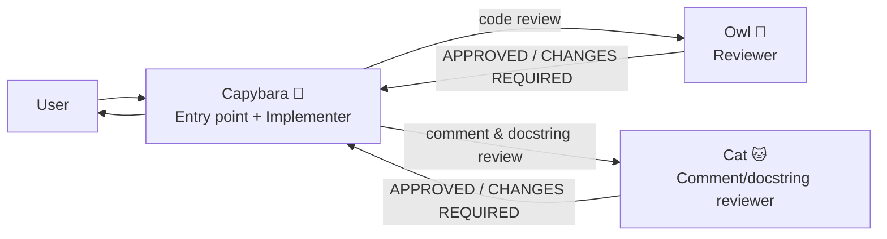
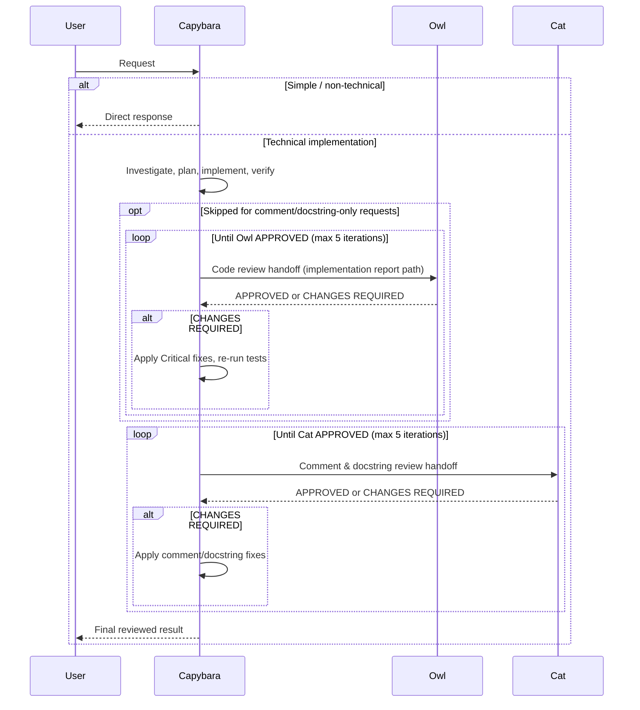

# GitHub Copilot Squad (Simplified)

A simplified orchestration setup for the **VS Code Agents window** (built on the Copilot SDK harness), and a leaner variant of [github-copilot-squad](https://github.com/kevinkwee/github-copilot-squad). It ships in two modes:

- **Trio (default)**: `Capybara` (entry point + implementer) + `Owl` (code reviewer) + `Cat` (comment/docstring reviewer).
- **Duo**: `Capybara` + `Owl` only, with no dedicated comment/docstring pass. The Duo behavior lives in `CapybaraDuo.agent.md`.

In both modes the goal is the same: keep implementation and review as **separate perspectives**, so technical work goes through a build → review loop before final output. What's removed (vs the original 4-agent squad) is the overhead of a separate execution agent and a separate lightweight helper.

## Why this simplified version exists

The original squad offloads implementation to a dedicated builder agent (`Otter`), with `Capybara` acting as a pure router. After using it on real-world tasks, that separation turned out to be **unnecessary** for this setup, for a few reasons:

- **A separate generalist implementer adds little value.** Spinning up a separate agent just to offload execution only pays off when that agent is **specialized**: a frontend specialist, a backend specialist, or a specific-framework specialist that brings domain knowledge the orchestrator lacks. Our implementer (`Otter`) was a **generalist**, just like `Capybara`. Two generalists don't give you more perspective; they give you more handoff overhead.
- **A fresh isolated context per request is expensive.** Because `Otter` is a separate subagent, every user request starts in a **fresh, isolated context**. That means more tokens and more time for the agent to re-read the codebase, re-analyze the problem, and rebuild understanding, even for a follow-up that builds directly on what was just done.
- **Merging keeps the working context warm.** When `Capybara` does the implementation itself, it **retains context about what was just built**. A subsequent request doesn't need the agent to reanalyze the same files and decisions over and over; the relevant context is already there.

### The trade-off

Merging the implementer into the entry point is not free:

| Approach | Pro | Con |
| --- | --- | --- |
| **Separate implementer** (`Otter`) | Each request gets a clean, isolated context, so the orchestrator's context window stays small. | Fresh context every time → more tokens and time to re-analyze. Temp reports capture what was done, but not the implementer's chain-of-thought or detailed analysis (what it read and reasoned through), so follow-ups can't reuse that thinking. |
| **Merged into `Capybara`** (this repo) | Full working context (including the chain-of-thought) carries over to follow-ups; no redundant re-analysis; fewer agent handoffs. | The context window grows as the conversation gets longer. |

The original concern with merging was that **the context window would fill up quickly**. In practice (after running it on real, multi-step tasks), that growth turned out to be **slower than expected**, and the benefit of warm, carry-over context outweighed the cost. Hence this simplified version.

> **When to use the original squad instead:** if you start wiring in **specialized** implementers (e.g. a frontend-focused agent that knows a specific UI framework, or a backend agent tuned to a particular stack), the separate-agent model becomes worth it again. This simplified repo assumes a single generalist does the building.

## Why a dedicated comment/docstring reviewer (Trio)

Agents sometimes write unnecessary, redundant, or inappropriate comments and docstrings, even when the rules are already stated in `AGENTS.md`. Owl's review covers this, but Owl also reviews the code implementation, so these prose issues sometimes get skipped in practice.

The Trio mode adds **Cat**, a reviewer that focuses **only** on comments and docstrings. It runs after Owl approves the implementation (or directly for comment/docstring-only requests), so the code is already correct; Cat's whole job is to groom the prose. The expected comment/docstring rules live in `AGENTS.md`, so they stay easy to update and maintain.

Because Cat owns the prose review, Trio also lets Capybara skip Owl and call Cat directly for **comment/docstring-only requests** (changes that touch only comments and/or docstrings), avoiding a redundant code-logic review pass when there is no logic change to review.

## The team (two modes)

**Trio (default)** adds a focused comment/docstring pass after Owl approves:


```mermaid
flowchart LR
  U[User] --> C[Capybara 🦫<br/>Entry point + Implementer]
  C -->|code review| O[Owl 🦉<br/>Reviewer]
  O -->|APPROVED / CHANGES REQUIRED| C
  C -->|comment & docstring review| A[Cat 🐱<br/>Comment/docstring reviewer]
  A -->|APPROVED / CHANGES REQUIRED| C
  C --> U
```

**Duo** is the lighter variant: the same flow without the Cat stage (Capybara → Owl → finish).

- **Capybara** is the only user-invocable agent. It receives the request, investigates, plans, implements, runs tests, and writes an implementation summary, then runs the review loop(s).
- **Owl** is not user-invocable. It reviews Capybara's implementation independently (correctness, completeness, quality, tests), classifies findings as Critical or Minor, and returns `APPROVED` or `CHANGES REQUIRED`.
- **Cat** (Trio only) is not user-invocable. After Owl approves, it reviews **only** the comments and docstrings, classifies findings as Critical or Minor, and returns `APPROVED` or `CHANGES REQUIRED`.
- Capybara applies all **Critical** findings from Owl (and Cat, in Trio), re-reviews if needed, and returns the final result to the user.

**Agent files in this repo:** in [`agents/`](agents/): `Capybara.agent.md` (Trio, default), `CapybaraDuo.agent.md` (Duo variant), `Owl.agent.md`, `Cat.agent.md`.

## Harness-agnostic design

The squad avoids naming tools so it does not break when the underlying Copilot SDK renames or reshapes them:

- Agent frontmatter pins no `tools:` list, so every agent inherits the harness default tool set.
- Instructions reference capabilities only: ask the user, create a todo list, run tests in a terminal, delegate to a reviewer as a subagent and wait for its verdict.
- Constraints such as "you MUST NOT call yourself as a subagent" live in the instructions, so they hold on every harness.

If a harness lacks a capability the squad depends on, such as asking the user, running commands, or delegating subagents, the agents surface that instead of silently degrading.

## Quick start

### Prerequisites

- VS Code with Copilot custom agents support (Agents window or Chat view)

### Option A: Repo-level agents (recommended)

Copy the agent profiles into:

- `.github/agents/*.agent.md`

This makes them available for that repository/workspace. In this repo the profiles live in [`agents/`](agents/), so copying (or linking) that folder's files into your project's `.github/agents/` is enough; the `skills/` folder ships `agents-md`, `commit-message`, and `pr-description` the same way.

### Option B: User-level agents

Create user-level custom agents with the **Agent Customizations editor** (or the **Chat: New Custom Agent** command), or place the `.agent.md` files in `~/.copilot/agents/`, the folder agent host sessions read user-level agents from.

This makes them available across your workspaces.

### Use it

1. Open the Agents window (or the Chat view) in VS Code.
2. Select `Capybara` (Trio, default) or `Capybara Duo` from the agent picker.
3. Ask your request naturally.
4. For technical requests, `Capybara` implements, then runs the Owl review loop (and, in Trio, the Cat comment/docstring loop).

## How the flow works

### 1) Entry point

`Capybara` receives every request directly. There is no router and no lightweight helper; it handles both technical and simple/non-technical requests itself:

- **Regular technical request** → investigate, plan, implement, verify, then enter the code review loop with Owl (and, in Trio, the Cat loop after).
- **Comment/docstring-only request** (Trio) → investigate, plan, implement, verify, then skip Owl and go straight to the Cat loop, since Owl reviews code logic and there is no logic change to review.
- **Simple / non-technical request** → answer directly (no review needed).
- **Ambiguous request** → asks a clarification question first.

### 2) Code review loop (Capybara ↔ Owl)

For technical requests, `Capybara` runs this loop. **In Trio, this loop is skipped for comment/docstring-only requests** (Capybara goes straight to the Cat loop in section 3, since there is no code logic to review):

1. Create report folder path: `.github/temp_reports/{YYYYMMDD_HHmmss}_{objective}/`
2. Implement the task and write `implementation_1.md` into that folder.
3. Hand off to `Owl` (focused handoff: the implementation report path, not the whole conversation).
4. If `Owl` returns **APPROVED** → in Trio, proceed to section 3 (the Cat loop); in Duo, return the final result.
5. If `Owl` returns **CHANGES REQUIRED** → apply every Critical fix, re-run tests, write a fresh `implementation_{iteration}.md` (next number), and call `Owl` again (Owl writes `review_{iteration}.md` with that same number).
6. Repeat until approved, max 5 iterations.

If still not approved after 5 iterations, `Capybara` stops and surfaces the remaining Critical issues for the user to decide (the Cat loop is skipped).

### 3) Comment & docstring review loop (Capybara ↔ Cat, Trio only)

Trio mode runs a second, focused loop with `Cat`. For regular technical requests it runs after Owl approves. For comment/docstring-only requests it runs right after implementation (Owl was skipped). Cat's review number always equals the `implementation_*.md` number it reviews, so when Owl approves `implementation_N.md`, Cat writes `docstring_review_N.md` (no increment between Owl and Cat):

1. Hand off to `Cat` (focused handoff: the report subfolder, the number N of the latest `implementation_*.md`, and every `implementation_*.md` Cat has not reviewed yet). At the Owl-to-Cat transition Cat is handed `implementation_1.md`..`implementation_N.md` (all of them, since this is its first review) but writes a single `docstring_review_{N}.md`. "Handed" scopes the handoff, not Cat's tool access. Cat can read more from disk if it needs extra context.
2. If `Cat` returns **APPROVED** → return the final result.
3. If `Cat` returns **CHANGES REQUIRED** → apply every Critical fix (and any cheap minor suggestions), re-run tests/lint if code is touched, write a fresh `implementation_{iteration}.md` (next number), and call `Cat` again (Cat writes `docstring_review_{iteration}.md` with that same number).
4. Repeat until approved, max 5 iterations.

If still not approved after 5 iterations, `Capybara` stops and surfaces the remaining Critical issues for the user to decide.

### Flow diagram (Trio)


```mermaid
sequenceDiagram
  participant U as User
  participant C as Capybara
  participant W as Owl
  participant A as Cat

  U->>C: Request

  alt Simple / non-technical
    C-->>U: Direct response
  else Technical implementation
    C->>C: Investigate, plan, implement, verify
    opt Skipped for comment/docstring-only requests
      loop Until Owl APPROVED (max 5 iterations)
        C->>W: Code review handoff (implementation report path)
        W-->>C: APPROVED or CHANGES REQUIRED
        alt CHANGES REQUIRED
          C->>C: Apply Critical fixes, re-run tests
        end
      end
    end
    loop Until Cat APPROVED (max 5 iterations)
      C->>A: Comment & docstring review handoff
      A-->>C: APPROVED or CHANGES REQUIRED
      alt CHANGES REQUIRED
        C->>C: Apply comment/docstring fixes
      end
    end
    C-->>U: Final reviewed result
  end
```

> Duo mode is the same flow without the Cat loop: after Owl approves, Capybara returns the final result.

## Agent responsibilities

### Capybara (`Capybara.agent.md`, Trio default)

- Single entry point: receives requests and acts on them directly.
- Does the technical work: investigate, plan, implement, run tests, lint/format.
- Manages the Capybara ↔ Owl code review loop, then the Capybara ↔ Cat comment/docstring loop (each max 5 iterations).
- For comment/docstring-only requests (Trio), skips the Owl loop and goes straight to the Cat loop.
- Applies **all** Critical findings from Owl and Cat; never skips them by reasoning them away.
- Asks clarifying questions (with freeform input) when the request is ambiguous.
- User-invocable; `disable-model-invocation: true` (so it always runs as the explicit entry point).

### Capybara Duo (`CapybaraDuo.agent.md`)

- The Duo variant of Capybara: same entry point + implementer role, but with only the Capybara ↔ Owl loop (no Cat pass).
- Use this when you don't want a dedicated comment/docstring review pass.

### Owl (`Owl.agent.md`)

- Reviews the code implementation for correctness, completeness, and quality.
- Reads the `implementation_{iteration}.md` summary **and** the actual changed files from disk.
- Runs available tests for touched modules to detect regressions.
- Classifies findings:
  - **Critical** → blocks approval (`CHANGES REQUIRED`)
  - **Minor** → suggestions only
- Writes `review_{iteration}.md` to the report subfolder.
- Not user-invocable; called only by Capybara.

### Cat (`Cat.agent.md`, Trio only)

- Reviews **only** the comments and docstrings in the changed files (after Owl approves the implementation).
- Does NOT review code logic, correctness, architecture, or tests; Owl owns that.
- Applies its own general principles (cold-reader oriented; comments explain WHY, never WHAT) and follows the detailed comment/docstring rules in `AGENTS.md`.
- Reads all `implementation_*.md` reports Capybara hands it (at the Owl-to-Cat transition, all of `implementation_1.md`..`implementation_N.md`; on later re-reviews, only the new `implementation_*.md` since its last `docstring_review_*.md`) and writes a single `docstring_review_{iteration}.md` per call. The handed reports scope the review, not what Cat may read. Cat can read more from disk if it needs extra context.
- Classifies findings:
  - **Critical** → blocks approval (`CHANGES REQUIRED`)
  - **Minor** → suggestions only
- Writes `docstring_review_{iteration}.md` to the report subfolder.
- Not user-invocable; called only by Capybara.

## Project code-writing rules (`AGENTS.md`)

`Capybara`, `Owl`, and `Cat` all treat an attached `AGENTS.md` as the source of truth for the project's stack, idioms, and quality bar (test commands, lint/format, naming, architecture rules, and the expected comment/docstring rules). The detailed code-writing rules have been **stripped out** of the agent profiles and moved into a per-project `AGENTS.md` that you provide alongside the agents.

A separate `AGENTS.md` is **easier to update and maintain**, especially when it contains a section that is **managed by the agent itself** (the agent can read and edit `AGENTS.md` in place without you having to edit the bundled agent profile).

> The template ships inside the `agents-md` skill below: fill the placeholder comments, delete the sections your project does not need, and adapt the language-specific examples to your stack. The skill automates this for you, both when creating a new file and when aligning an existing one.

## AGENTS.md skill

The repo ships a skill that applies the template to your project. The template lives inside the skill at [`skills/agents-md/assets/AGENTS-template.md`](skills/agents-md/assets/AGENTS-template.md):

```text
skills/
└── agents-md/
    ├── SKILL.md              # the procedure (create + adapt modes)
    └── assets/
        └── AGENTS-template.md # the canonical template
```

- **`/agents-md create`**: inspects the repo (stack, versions, commands, layout, test and coverage tooling), asks only for facts the code cannot answer, then fills the template's placeholders and drops the sections your project does not need. Produces a ready, project-specific `AGENTS.md` (default: repo root).
- **`/agents-md adapt <path>`**: audits an existing `AGENTS.md` against the template, then proposes add/modify/keep changes. Deliberate project-specific choices are preserved and flagged, never silently overwritten. The skill's writing conventions (no em/en dashes, no hyphen-as-clause-separator) always converge.
- **Deployment**: `skills/` sits at the repo root on purpose. Clone this whole repo into your project's `.github/` folder (or copy just the `skills/` folder into it) and the skill lands at `.github/skills/agents-md/`, where VS Code discovers it.
- **Template edits**: edit `skills/agents-md/assets/AGENTS-template.md` directly; it is the single canonical template inside this repo, and the skill always reads it from there.

## Commit message skill

A second shipped skill writes commit messages:

```text
skills/
└── commit-message/
    └── SKILL.md              # Conventional Commits procedure
```

- **`/commit-message`**: reads the staged changes (`git diff --cached`), matches the repo's recent message style, and writes a Conventional Commits message (type, optional scope, imperative single-line description, optional body and footer, `!` before the colon for breaking changes). It never stages files itself, and never mentions unstaged changes.
- **After presenting the message** it asks how to proceed: commit as-is, revise, or leave it as message only. The commit follows PowerShell-safe quoting rules (single-quote strategy, or the backtick escape when double quotes are needed), one `-m` per paragraph.
- **Deployment**: same model as `agents-md`; the skill is discovered at `.github/skills/commit-message/` when this repo is cloned or the `skills/` folder copied into your project's `.github/`.

## PR description skill

A third shipped skill writes PR titles and descriptions:

```text
skills/
└── pr-description/
    └── SKILL.md              # PR title + description procedure
```

- **`/pr-description`**: derives the base branch and merge base, reads every commit message on the branch plus the diff, then writes a Conventional Commits style title (single line, imperative, `!` before the colon when breaking) and a full description. Uses repo-level PR templates when found (`.github/PULL_REQUEST_TEMPLATE.md`), falls back to a built-in default format (Summary, Type of Change, Key Changes, Notes, How This Has Been Tested).
- **Template handling**: a user-supplied template wins, and the result is returned in a code block rather than written into any template file (unless you explicitly ask for that).
- **After presenting** the title and description it asks how to proceed: create the PR as-is (confirming the target branch first), or text only. Freeform input revises it.
- **Deployment**: same model as the other skills; discovered at `.github/skills/pr-description/`.

## Compared to the original squad

| | Original (`github-copilot-squad`) | This repo: Trio (default) | This repo: Duo |
| --- | --- | --- | --- |
| Agents | 4 (Capybara, Otter, Owl, Squirrel) | 3 (Capybara, Owl, Cat) | 2 (Capybara, Owl) |
| Routing | Capybara is a pure router | No router; Capybara is the entry point | No router; Capybara is the entry point |
| Implementation | Offloaded to a separate agent (`Otter`) | Done by Capybara itself | Done by Capybara itself |
| Simple / non-technical | Handled by a lightweight helper (`Squirrel`) | Handled by Capybara directly | Handled by Capybara directly |
| Code review | Owl | Owl | Owl |
| Comment/docstring review | Part of Owl's review | Cat (dedicated pass, after Owl or directly for comment/docstring-only) | Part of Owl's review |
| Context per request | Fresh isolated context for each implementation | Warm, carry-over context between follow-ups | Warm, carry-over context between follow-ups |
| Handoffs | More (router → builder → reviewer) | Fewer (builder+orchestrator → Owl → Cat) | Fewest (builder+orchestrator → Owl) |
| Best for | Specialized implementers, strict context isolation | Generalist implementer, iterative multi-step work, clean docs | Generalist implementer, minimal review overhead |

## Fun facts 🐣

| Role | Animal | Why it fits |
| --- | --- | --- |
| Entry point + Implementer | Capybara 🦫 | Calm, friendly, and sociable. Comfortable doing the work itself and coordinating the review without the drama. |
| Code reviewer | Owl 🦉 | Classic symbol of wisdom and sharp observation. Spots sneaky issues and keeps everything in check. |
| Comment/docstring reviewer | Cat 🐱 | Fastidious groomer. Spends much of its day grooming its coat until every hair lies just right; grooms comments and docstrings until every word earns its place. (Trio only) |

> The original squad also had **Otter** 🦦 (the playful, tool-skilled builder) and **Squirrel** 🐿️ (the quick, nimble helper). Both were folded into Capybara here; one generalist builder is enough until you need specialists. **Cat** 🐱 is new to this simplified repo, added for the Trio mode's dedicated comment/docstring pass.

## How to use

- Start a session with `Capybara` (Trio, default) or `Capybara Duo` (Duo, no Cat pass).
- Ask naturally:
  - Technical request example: "Add endpoint X with validation and tests."
  - Non-technical request example: "Explain this repository architecture."
- `Capybara` handles it directly. For technical tasks, Trio runs the Owl loop then the Cat loop; Duo runs only the Owl loop.
- Reports are generated under `.github/temp_reports/` per iteration.

## Report artifacts

During technical tasks, expect:

- `implementation_{iteration}.md` (from Capybara)
- `review_{iteration}.md` (from Owl)
- `docstring_review_{iteration}.md` (from Cat, Trio only)

inside:

- `.github/temp_reports/{timestamp_objective}/`

This creates a lightweight audit trail of what was implemented and what was reviewed.

## Customization

Common tweaks you can make:

- Change models in frontmatter (`model:`)
- Pin a tool list in frontmatter (`tools:`) if you want to restrict access. The shipped agents omit `tools:` and inherit the harness defaults, so SDK tool renames cannot break them
- Switch between Trio (`Capybara`) and Duo (`Capybara Duo`)
- Adjust code review strictness in `Owl`
- Adjust comment/docstring review strictness in `Cat`
- Change max loop policy in `Capybara` (default: 5 iterations per loop)
- Adapt tone/style prompts

## Official references

- <https://code.visualstudio.com/docs/agent-customization/custom-agents>
- <https://code.visualstudio.com/docs/agent-customization/agent-skills>
- <https://code.visualstudio.com/docs/agents/run/subagents>
- <https://code.visualstudio.com/docs/agents/run/tools>

## License

MIT (see `LICENSE`).
